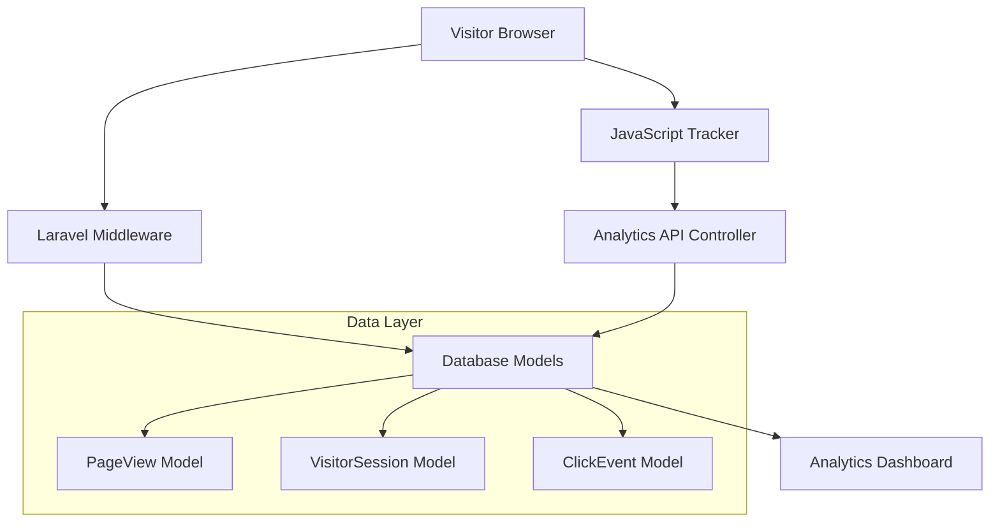

# Design Document

## Overview

This design addresses the critical issues preventing the analytics system from capturing visitor data. The system architecture is sound, but several configuration and integration issues need to be resolved to make it functional.

## Architecture

The analytics system follows a layered architecture:



## Components and Interfaces

### 1. Middleware Registration Fix

**Problem**: The middleware is referenced but not actually registered in `bootstrap/app.php`.

**Solution**: Properly register the middleware using Laravel 11's new middleware registration syntax.

```php
// In bootstrap/app.php
->withMiddleware(function (Middleware $middleware): void {
    $middleware->web(append: [
        \App\Http\Middleware\TrackPageViews::class,
    ]);
})
```

### 2. CSRF Token Integration

**Problem**: JavaScript analytics tracker cannot make API calls without CSRF token.

**Solution**: Ensure CSRF token is available in all layouts and handle it properly in the JavaScript.

**Layout Integration**:
```php
// In main layout file
<meta name="csrf-token" content="{{ csrf_token() }}">
```

**JavaScript Enhancement**:
```javascript
// Enhanced CSRF token handling with fallback
function getCSRFToken() {
    return document.querySelector('meta[name="csrf-token"]')?.content || 
           document.querySelector('input[name="_token"]')?.value ||
           window.Laravel?.csrfToken;
}
```

### 3. Session Management

**Problem**: Session might not be started when middleware runs.

**Solution**: Ensure session is properly initialized and handle edge cases.

**Enhanced Session Handling**:
```php
// In TrackPageViews middleware
private function ensureSession(Request $request): string
{
    if (!$request->hasSession()) {
        $request->setLaravelSession(app('session.store'));
    }
    
    $sessionId = $request->session()->getId();
    if (!$sessionId) {
        $request->session()->start();
        $sessionId = $request->session()->getId();
    }
    
    return $sessionId;
}
```

### 4. Database Migration Verification

**Problem**: Analytics tables might not exist if migration wasn't run.

**Solution**: Add verification and provide clear error handling.

**Migration Check**:
```php
// Add to middleware or service provider
private function verifyTablesExist(): bool
{
    try {
        return Schema::hasTable('page_views') && 
               Schema::hasTable('visitor_sessions') && 
               Schema::hasTable('click_events');
    } catch (\Exception $e) {
        Log::warning('Analytics tables verification failed: ' . $e->getMessage());
        return false;
    }
}
```

## Data Models

The existing models are well-designed but need relationship fixes:

### Enhanced Model Relationships

```php
// VisitorSession model enhancement
public function pageViews()
{
    return $this->hasMany(PageView::class, 'session_id', 'session_id');
}

// PageView model enhancement  
public function session()
{
    return $this->belongsTo(VisitorSession::class, 'session_id', 'session_id');
}
```

## Error Handling

### Graceful Degradation Strategy

1. **Database Errors**: Log but don't break page load
2. **API Failures**: Silent failure with debug logging
3. **Session Issues**: Create temporary session or skip tracking
4. **Network Errors**: Use `keepalive` and `sendBeacon` for reliability

### Error Logging

```php
// Enhanced error handling in middleware
try {
    // Analytics tracking code
} catch (\Exception $e) {
    Log::channel('analytics')->warning('Analytics tracking failed', [
        'url' => $request->fullUrl(),
        'error' => $e->getMessage(),
        'session_id' => $sessionId ?? 'unknown'
    ]);
}
```

## Correctness Properties

*A property is a characteristic or behavior that should hold true across all valid executions of a system-essentially, a formal statement about what the system should do. Properties serve as the bridge between human-readable specifications and machine-verifiable correctness guarantees.*

Property 1: Public page tracking
*For any* public page URL (non-admin, non-API), when a visitor accesses it, a page view record should be created in the database
**Validates: Requirements 1.2, 4.1**

Property 2: Admin page exclusion
*For any* admin page URL, when accessed, no page view records should be created in the database
**Validates: Requirements 1.3**

Property 3: API request exclusion
*For any* API endpoint, when accessed, no page view records should be created in the database
**Validates: Requirements 1.4**

Property 4: Session initialization
*For any* visitor request, when they arrive on the site, a valid session should be created or retrieved
**Validates: Requirements 2.1**

Property 5: CSRF token authentication
*For any* analytics API call with a valid CSRF token, the request should be accepted and processed successfully
**Validates: Requirements 2.3**

Property 6: Graceful error handling
*For any* analytics operation that encounters an error, the system should continue functioning without breaking the user experience
**Validates: Requirements 2.4, 3.3, 5.5**

Property 7: Data persistence
*For any* valid analytics data, when captured, it should be successfully stored in the appropriate database table
**Validates: Requirements 3.2, 4.1, 4.2**

Property 8: Click event tracking
*For any* user interaction with trackable elements (links, buttons), a click event record should be created in the database
**Validates: Requirements 4.2, 5.2**

Property 9: Session metrics updates
*For any* ongoing visitor session, when page views or time data changes, the session metrics should be updated accordingly
**Validates: Requirements 4.3**

Property 10: Device information capture
*For any* visitor with detectable device information, the system should capture and store browser, platform, and device type data
**Validates: Requirements 4.5**

Property 11: Time tracking updates
*For any* visitor spending time on a page, the time-on-page data should be updated periodically without disrupting the user experience
**Validates: Requirements 5.3**

## Testing Strategy

### Unit Tests
- Test middleware registration and execution
- Test API controller validation and data storage
- Test model relationships and data integrity
- Test JavaScript tracker initialization and API calls

### Property-Based Tests
- Each correctness property will be implemented as a property-based test
- Tests will run with minimum 100 iterations to ensure comprehensive coverage
- Each test will be tagged with: **Feature: analytics-system-fix, Property {number}: {property_text}**

### Integration Tests  
- Test complete page view tracking flow
- Test click event tracking end-to-end
- Test session management across requests
- Test error handling scenarios

### Manual Testing
- Verify data appears in database after page visits
- Verify admin dashboard displays tracked data
- Test tracking across different browsers and devices
- Verify tracking is disabled in admin areas